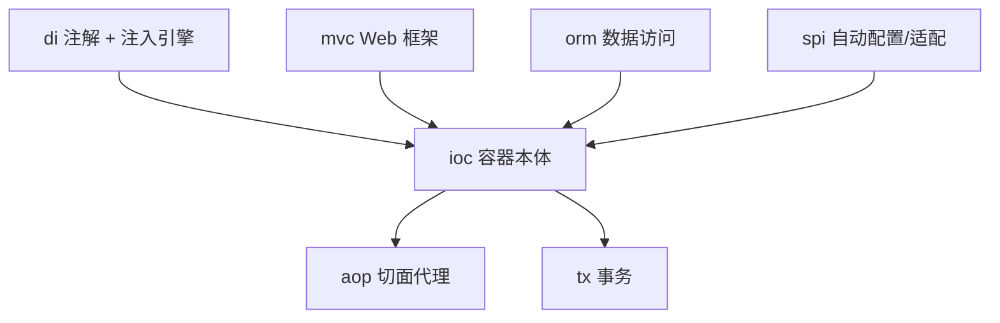

# LightSSM — 手写版轻量级 SSM 框架

> 用 ~5000 行代码复刻 Spring + SpringMVC + MyBatis 的核心机制，结构刻意与官方源码对齐，用于**深度学习框架原理**与**面试原理锚定**。
> 详细架构图与数据流见 [`docs/ARCHITECTURE.md`](docs/ARCHITECTURE.md)；代码内 `// TODO` 总览见 [`docs/TODO.md`](docs/TODO.md)。

## 它是什么

LightSSM 不是生产框架，而是“原理显微镜”：把 IoC、AOP、MVC、ORM、事务五大机制拆开，用尽量少的代码把**核心算法**讲清楚，并保留与 Spring/MyBatis 同名的类与方法，方便对照官方源码读。

| 维度 | Spring 官方 | LightSSM |
|------|------------|----------|
| 代码量 | ~20 万行 | ~5000 行 |
| BeanFactory 层级 | 7 层接口 | 3 层接口 |
| AOP | 完整 AspectJ 集成 | JDK / CGLIB 双代理 |
| 事务 | 声明式 + 编程式 | 声明式 + 编程式 |
| 适用场景 | 企业生产 | 学习 / 面试 |

## 模块拓扑



| 包 | 职责 |
|----|------|
| `com.lightframework.di` | 注解（`@Component/@Autowired/@Value/...`）+ 注入引擎（`InjectionEngine`/`InjectionMetadata`/`DependencyContainer`） |
| `com.lightframework.ioc` | 容器本体：`BeanFactory`、`DefaultListableBeanFactory`、上下文、三级缓存、作用域、事件、健康检查 |
| `com.lightframework.aop` | 双代理 `ProxyFactory` + `Jdk/CglibAopProxy`、`MethodInvocation` 责任链、`AspectJAutoProxyCreator` |
| `com.lightframework.mvc` | `DispatcherServlet` + `HandlerMapping`/`HandlerAdapter`/`ViewResolver` |
| `com.lightframework.orm` | `SqlSession`/`Executor`/`MappedStatement`/`MapperProxy`/`TypeHandler`/`InterceptorChain` |
| `com.lightframework.tx` | `TransactionInterceptor` + `TransactionalBeanPostProcessor` + `DataSourceTransactionManager` |
| `com.lightframework.spi` | 经 `META-INF/lightssm.spi` 装载的自动配置 + hutool/jackson/caffeine/mybatis 适配 |

> **`ioc` 与 `di` 已收尾为单一来源**：早期 `ioc.annotation` / `ioc.core` 内的一批 `@Deprecated` 兼容壳全部删除，注解与注入引擎的唯一实现落在 `di` 包（详见下方“最近清理”）。

## 快速开始

```java
// 1) IoC 容器
ApplicationContext ctx = new AnnotationConfigApplicationContext("com.example");
UserService svc = ctx.getBean(UserService.class);

// 2) MVC 控制器
@Controller @RequestMapping("/user")
public class UserController {
    @Autowired private UserService userService;
    @GetMapping("/list") @ResponseBody
    public List<User> list() { return userService.findAll(); }
}

// 3) ORM Mapper（XML）
// <select id="selectById" resultType="com.example.User">
//   SELECT * FROM user WHERE id = #{id}
// </select>

// 4) AOP
@Aspect @Component
public class LogAspect {
    @Before("execution(* com.example.service.*.*(..))")
    public void before(JoinPoint jp) { System.out.println(jp.getMethodName()); }
}
```

> Web 入口为 `DispatcherServlet`（继承 `HttpServlet`），需在 `web.xml` 注册并指向 IoC 上下文。

## 构建与测试

```bash
./mvn.sh -s ci-settings.xml clean test    # 联网（中央镜像）编译并跑全部单测
./mvn.sh -s ci-settings.xml -o compile     # 依赖已缓存时离线编译
```

`mvn.sh` 会自动探测 Maven `boot/` 下的 `plexus-classworlds` 版本，避免写死版本号导致启动失败。当前全量 **321 条测试 0 失败 / 0 错误**（5 条按环境跳过）；`pom.xml` 已内置 JDK 17 所需的 `--add-opens` 参数，CGLIB 测试可直接运行。

## 核心特性

- **IoC/DI**：ASM 字节码扫描、`@Component`/`@Autowired`/`@Resource`/`@Value` 注入、基于三级缓存的循环依赖、运行前健康检查（Tarjan 环检测 + 构造器环 `@Lazy` 自动修复）。
- **SpringMVC**：`DispatcherServlet` → `HandlerMapping` → `HandlerAdapter` → `ViewResolver`，`@RequestMapping`/`@RequestParam`/`@PathVariable`/`@RequestBody`，拦截器链。
- **ORM**：`SqlSession`/`Executor`/`MapperProxy` 动态代理、`#{}` 参数绑定、ResultMap 反射映射、`InterceptorChain` 插件、连接池（Pooled/Unpooled/Druid）、25 个 `TypeHandler`。
- **AOP**：JDK/CGLIB 双代理、`@Before/@After/@Around/@AfterReturning/@AfterThrowing`、`MethodInvocation` 递归责任链、AspectJ 表达式切入点。
- **事务**：`TransactionInterceptor` + `TransactionalBeanPostProcessor` + `DataSourceTransactionManager`，支持 7 种传播行为 / 5 种隔离级别 / 重试。

## 已知缺口（近期待办）

| 优先级 | 缺口 |
|--------|------|
| ✅ **P0（已修复）** | **AOP 接入容器**：`AspectJAutoProxyCreator` 已通过 `META-INF/lightssm.spi` 作为 `@Component` 登记进 BPP 链，真实容器内 `@Aspect` 切面可织入（端到端测试 `AopContainerWeavingTest` 已验证）。同时修复了切点类级匹配与命名切点 `()` 解析两处 bug。 |
| **P0** | **`@Bean` 形式 `BeanPostProcessor` 不进 BPP 链**：`registerBeanPostProcessors()` 早于 `processBeanMethods()` 运行，导致 `@Bean` 声明的 BPP（如事务的 `TransactionalBeanPostProcessor`）永不生效，声明式事务在容器内同样未织入。AOP 用 SPI 直登绕过该缺陷，彻底修复需提前处理 BPP 的 `@Bean`。 |
| P1 | 切面解析顺序依赖（目标须晚于切面创建，否则不织入）；request/session 作用域双 `ScopeRegistry` 未接通；ORM 插件仅 `StatementHandler` 一处插桩。 |
| P2 | 事务事件发布器、ORM 一级缓存、动态 SQL（仅 `if`/`trim`）等半成品特性。 |

完整 TODO 清单见 [`docs/TODO.md`](docs/TODO.md)（自动扫描生成，含等级/分类/位置）。

## 文档导航

- [`docs/ARCHITECTURE.md`](docs/ARCHITECTURE.md) — 架构总览、数据流图、已知缺口
- [`docs/01`~`docs/10`](docs/) — 各模块深度剖析与 Spring 源码逐行对比
- [`docs/TODO.md`](docs/TODO.md) — 代码内 TODO 索引
- [`docs/PRACTICE.md`](docs/PRACTICE.md) — 练手顺序与思路（从零开始推荐先看这里）
- [`docs/TODO-GUIDE.md`](docs/TODO-GUIDE.md) — 如何新增/补充 TODO

## 最近清理（本次提交）

- 删除 `ioc.annotation` / `ioc.core` 下的 `@Deprecated` 兼容壳（`InjectionEngine`/`TypeConverter`/`FieldInjector`/`BeanInjector`/`AnnotationMetadata` 等），完成 ioc→di 迁移收尾，并把 `EventListener` 迁入 `di.annotation`。
- 删除零引用的重复/死代码：`orm.type.TypeHandlerSystem`（706 行全家桶副本）、`orm.executor.statement.SimpleStatementHandler`、aop `CompositeInterceptor`、`ioc.context.LightActuator`/`ValueAnnotationValidator`、无实现无引用的空壳 spi 契约（template/schedule/config）。
- 归并 `spi.Ordered` 到 `ioc.core.Ordered`，同步 `reflect-config.json` 与 native-image 配置到 `di.annotation`。
- 统一代码内 `// TODO [Lx][分类]` 标记（161 条），删除误报条目、合并重复项，并生成 `docs/TODO.md` 索引。
- 收尾清理漏网的空壳 `spi.conversion`（零引用零实现），并把工作目录缓存 `.workbuddy/` 加入 `.gitignore`。
- `pom.xml` 的 Surefire 增加 `--add-opens java.base/java.lang=ALL-UNNAMED`，修复 JDK 17 下 CGLIB 测试因模块访问限制而报错的问题。
- 新增 `docs/PRACTICE.md` 练手路线：按“独立小方法 → 容器机制 → 模块实现 → 设计模式 → 真缺口”排序，并附每种模式的拆解思路。

## License

MIT
