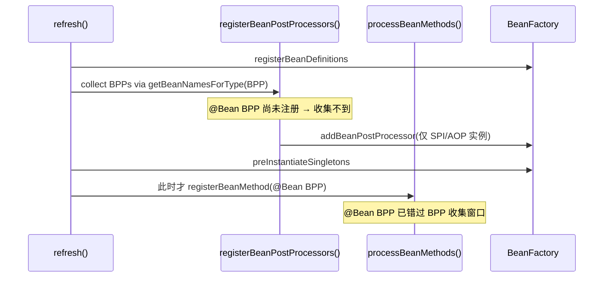
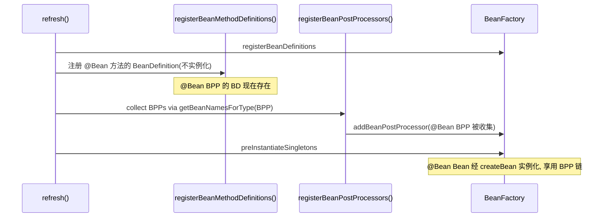

# P0 修复设计文档：`@Bean` 形式 `BeanPostProcessor` 未进入 BPP 链

> 状态：设计稿（待批准后再改代码）
> 关联：`docs/ARCHITECTURE.md` §7 P0 缺口、`README.md` 已知缺口
> 影响范围：IoC 启动顺序、声明式事务（Tx）在真实容器内生效

---

## 1. 根因分析（Root Cause）

### 1.1 `refresh()` 当前顺序

`AnnotationConfigApplicationContext.refresh()`（行号以当前源码为准）：

| 步骤 | 方法 | 行号 | 职责 |
|------|------|------|------|
| 1 | `registerBeanDefinitions()` | 100 | 注册组件类 BeanDefinition |
| 2 | `runIoCHealthCheck()` | 103 | 循环依赖检测/自动修复 |
| 3 | `discoverSpiAutoConfigurations()` | 106 | SPI 自动配置 |
| 4 | `processImports()` | 111 | `@Import` 处理 |
| 5 | `invokeBeanDefinitionRegistryPostProcessors()` | 114 | BDRPP |
| 6 | `invokeBeanFactoryPostProcessors()` | 116 | BFPP |
| 7 | `initApplicationEventMulticaster()` | 119 | 事件广播器 |
| 8 | **`registerBeanPostProcessors()`** | **121** | **收集 BPP 进链** |
| 9 | `preInstantiateSingletons()` | 123 | 预实例化单例 |
| 10 | **`processBeanMethods()`** | **126** | **此时才把 `@Bean` 方法注册为 BeanDefinition 并实例化** |

### 1.2 缺陷点

`registerBeanPostProcessors()`（646–657 行）通过：

```java
String[] postProcessorNames = this.beanFactory.getBeanNamesForType(BeanPostProcessor.class);
for (String ppName : postProcessorNames) {
    BeanPostProcessor pp = this.beanFactory.getBean(ppName, BeanPostProcessor.class);
    this.beanFactory.addBeanPostProcessor(pp);
}
```

在第 8 步执行。但所有 `@Bean` 形式声明的 `BeanPostProcessor`（如 `TransactionAutoConfiguration.txBeanPostProcessor()` 返回的 `TransactionalBeanPostProcessor`）**在第 10 步 `processBeanMethods()` → `registerBeanMethod()` 才被注册为 BeanDefinition**。因此在第 8 步时它们根本不存在于工厂，永远不会被收集进 BPP 链。

### 1.3 后果

- `@Transactional` 声明式事务在真实容器内**不织入**（无事务代理、无拦截器）。
- AOP 通过「SPI 直接登记具体 `@Component` 类」绕过了该缺陷；事务（Tx）仍走 `@Bean`，故未绕过 → 这是当前唯一因该缺陷而失效的核心能力。
- 任何用户用 `@Configuration` + `@Bean BeanPostProcessor` 做扩展，在容器内均不生效。



---

## 2. 当前 `@Bean` 机制事实（避免误判）

`processBeanMethods()`（584–607 行）：
- 遍历所有 BeanDefinition → 找 `@Configuration` 类 → `getBean(beanName, beanClass)` **实例化配置类** → `createConfigurationProxy()` 生成 CGLIB 代理（缓存 `@Bean` 结果）→ 对每个 `@Bean` 方法调用 `registerBeanMethod()`。

`registerBeanMethod()`（497–579 行）：
- 评估 `@Conditional` → 解析方法参数（DI，支持 `@Qualifier`/`@Lazy`）→ 反射 `method.invoke(configInstance, args)` 得到实例 → `registerBeanDefinition` + `registerSingleton` → `populateBean` + `initializeBean`（**若此时 BPP 链为空，则无后置处理**）。

关键约束：`@Bean` 方法**必须**在配置类实例上调用，因此"注册定义"与"实例化 @Bean"目前被耦合在同一次 `processBeanMethods()` 调用里。

---

## 3. 修复方案（推荐）

### 3.1 核心思想

对齐 Spring 语义：把 `@Bean` 方法的 **BeanDefinition 注册**提前到 `registerBeanPostProcessors()` 之前（仿 Spring `ConfigurationClassPostProcessor` 在 BFPP 阶段注册 `@Bean` BD），而 **`@Bean` 实例的创建**仍留在 `preInstantiateSingletons()` 阶段（此时 BPP 链已就绪）。从而：

1. `@Bean` 声明的 BPP 能被 `registerBeanPostProcessors()` 收集进链；
2. 所有 `@Bean` Bean 仍能享受 BPP 后置处理（AOP 代理、`@Autowired` via BPP 等），不回退。

### 3.2 改造步骤

1. **`BeanDefinition` 增加可选元数据**（不破坏既有构造器/字段注入路径）：
   - `String configurationBeanName`：声明该 `@Bean` 的配置类 Bean 名；
   - `Method beanMethod`（或方法名 + 参数类型）：对应的 `@Bean` 方法；
   - getter/setter 各一。

2. **新增 `registerBeanMethodDefinitions()`**（替代 `processBeanMethods()` 的"注册"职责）：
   - 扫描 `@Configuration` BeanDefinition；
   - 对每个 `@Bean` 方法创建一个携带上述元数据的 `BeanDefinition`（`beanClass = 方法返回类型`，`scope = singleton`）；
   - 评估 `@Conditional`（`evaluateMethodConditions`）；
   - `registerBeanDefinition(beanName, bd)`，**不实例化**。

3. **`refresh()` 重排**：
   ```
   ... invokeBeanFactoryPostProcessors()        // 116
   initApplicationEventMulticaster()            // 119
   registerBeanMethodDefinitions()              // 【新增，在 BPP 收集之前】
   registerBeanPostProcessors()                 // 121（现已能收集到 @Bean BPP）
   preInstantiateSingletons()                   // 123
   // 配置类 CGLIB 代理创建并入单例缓存（可在 preInstantiateSingletons 前/中）
   ```

4. **`DefaultListableBeanFactory` 的 `createBean`/`doCreateBean` 路径**：若 `bd` 携带 bean-method 元数据，则：
   - `configInstance = getBean(configurationBeanName)`（已是 CGLIB 代理）；
   - 解析方法参数（复用 `resolveDependency`，含 `@Qualifier`/`@Lazy`）；
   - `Object instance = beanMethod.invoke(configInstance, args)`；
   - `populateBean` + `initializeBean`（**BPP 链已就绪** → `@Bean` Bean 也能被 AOP 代理）。

5. **`processBeanMethods()` 重构**：仅负责"为 `@Configuration` Bean 创建 CGLIB 代理并注册到单例缓存"（保证 `@Bean` 方法调用走代理缓存语义），不再承担 `@Bean` 注册；或直接并入 `registerBeanMethodDefinitions` 的代理创建步骤。



### 3.3 备选方案（对比）

| 方案 | 做法 | 优点 | 缺点 | 结论 |
|------|------|------|------|------|
| A | 把 `processBeanMethods()` 整体移到 `registerBeanPostProcessors()` 之前 | 改动最小 | `@Configuration` 与 `@Bean` Bean 在 BPP 链就绪前实例化 → 享受不到 AOP 代理/`@Autowired` via BPP，属回退 | 不推荐 |
| B | `registerBeanPostProcessors()` 开头对 `@Configuration` 做一次"@Bean BPP 预扫描"，单独 `addBeanPostProcessor` | 改动小、风险低 | 未根治：其他 `@Bean` Bean 仍可能错过 BPP | 中间落地方案 |
| **C（推荐）** | 拆分"注册定义"与"实例化"，对齐 Spring BFPP 语义 | 根治、语义正确、不回退 | 改动中等，需 `BeanDefinition` 支持 bean-method 元数据 | **采用** |

---

## 4. 受影响文件

| 文件 | 改动 |
|------|------|
| `src/main/java/com/lightframework/ioc/context/AnnotationConfigApplicationContext.java` | `refresh()` 重排；新增 `registerBeanMethodDefinitions()`；`processBeanMethods()` 重构；`registerBeanPostProcessors()` 移除/更新 TODO |
| `src/main/java/com/lightframework/ioc/beans/BeanDefinition.java` | 增加 bean-method 元数据字段 + getter/setter |
| `src/main/java/com/lightframework/ioc/core/DefaultListableBeanFactory.java` | `createBean`/`doCreateBean` 支持 bean-method 实例化 |
| `src/test/java/com/lightframework/ioc/container/BeanPostProcessorBeanMethodTest.java`（新增） | 回归测试：`@Configuration` + `@Bean` 一个记录调用的 `BeanPostProcessor`，断言容器内生效 |
| `docs/ARCHITECTURE.md` §7 | 该 P0 标记"已修复" |
| `README.md` 已知缺口 | 同步 |
| `docs/TODO.md` | 更新/移除对应 TODO |

---

## 5. 风险与边界

- **`@Bean` 方法参数 DI**：`@Qualifier`/`@Lazy` 需在 `createBean` 路径正确解析（复用现有 `resolveDependency`）。
- **`@Conditional` `@Bean`**：`evaluateMethodConditions` 需在注册定义阶段判断，避免条件不满足的 `@Bean` 被注册。
- **配置代理缓存语义**：同一 `@Bean` 多次调用须返回同一实例（CGLIB 代理拦截），不可破坏。
- **与 AOP BPP 顺序**：`TransactionalBeanPostProcessor` 与 `AspectJAutoProxyCreator` 同为 BPP；目标 Bean 须在两者之后才实例化（已由 `@DependsOn`/预解析处理）。
- **`preInstantiateSingletons` 兼容性**：须能实例化 bean-method 类型 BeanDefinition。

---

## 6. 验证（Verification）

1. **单元测试（核心回归）** `BeanPostProcessorBeanMethodTest`：
   - 容器内注册一个 `@Configuration`，其中 `@Bean` 返回一个记录调用的 `BeanPostProcessor`（`postProcessAfterInitialization` 向共享 `List<String>` 追加 beanName）；
   - 注册若干普通 `@Component` 目标 Bean；
   - `refresh()` 后断言共享 List 含这些目标名 → 证明 `@Bean` BPP 进入 BPP 链并生效。
   - 修复前该断言失败（BPP 未被收集），修复后通过。

2. **端到端 Tx 证据（可选但建议）**：容器内启用 `TransactionAutoConfiguration` 的 `@Bean`，对 `@Transactional` 方法调用，断言拦截内 `TransactionSynchronizationManager.isActualTransactionActive()` 为 `true`。

3. **全量回归**：`./mvn.sh -s ci-settings.xml -B test` → 321 测试仍全绿（修复不改变既有行为，仅补齐 `@Bean` BPP 能力）。
