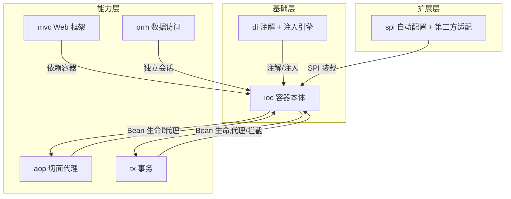
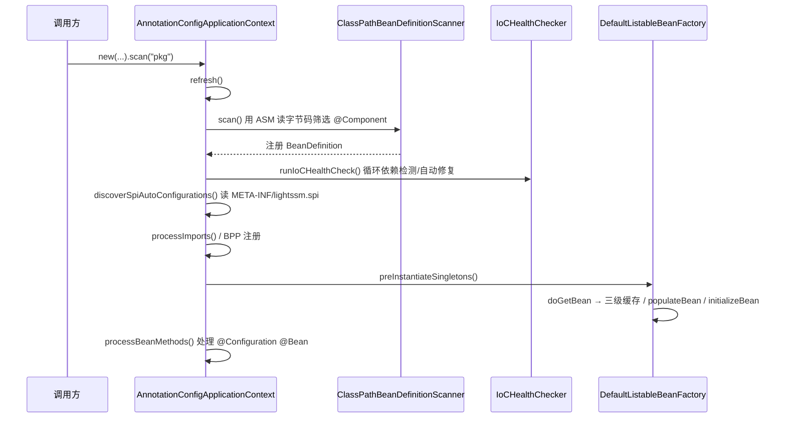
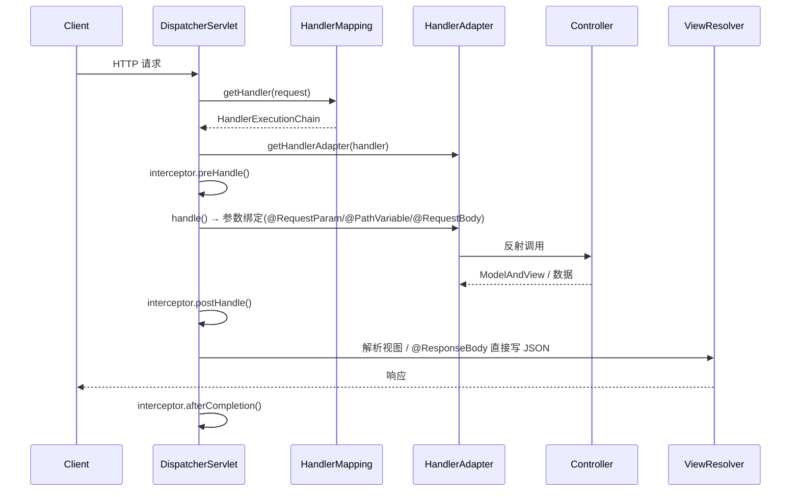
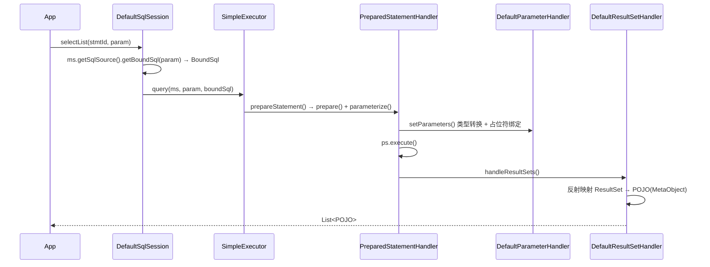
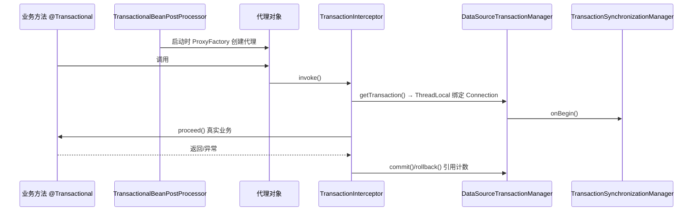

# LightSSM 架构总览

> 一份文档讲清 LightSSM 的设计哲学、模块划分、核心数据流与已知缺口。
> 配套详细实现文档见 `docs/02`~`docs/10`；代码内 `// TODO [Lx][分类]` 清单见 `docs/TODO.md`。

## 1. 这是什么

LightSSM 是一个**教学型**轻量级 SSM（Spring + SpringMVC + MyBatis）框架：用约 5000 行手写代码复刻三大框架的核心机制，结构刻意与官方源码对齐，便于对照学习。它不是生产框架，而是“原理显微镜”。

| 维度 | Spring 官方 | LightSSM |
|------|------------|----------|
| 代码量 | ~20 万行 | ~5000 行 |
| BeanFactory 层级 | 7 层接口 | 3 层接口 |
| AOP | 完整 AspectJ 集成 | JDK / CGLIB 双代理 |
| 事务 | 声明式 + 编程式 | 声明式 + 编程式 |
| 适用场景 | 企业生产 | 学习 / 面试 |

## 2. 模块拓扑



### 包职责一览

| 包 | 职责 | 关键点 |
|----|------|--------|
| `com.lightframework.di.annotation` | 注入相关注解 | `@Component/@Autowired/@Resource/@Value/@Scope/@Lazy/@Qualifier/@Primary/@Bean/@Configuration/@Import/@Conditional/@Profile/@DependsOn/@Order/@EventListener` |
| `com.lightframework.di.core` | 依赖注入引擎 | `InjectionEngine` / `InjectionMetadata` / `AnnotationInjectEntry` / `DependencyContainer` / `DefaultTypeConverter` / `PlaceholderResolver` |
| `com.lightframework.ioc` | 容器本体（不与 di 重复） | `BeanFactory`/`ListableBeanFactory`/`BeanDefinitionRegistry`、`DefaultListableBeanFactory`、上下文、作用域、事件、健康检查 |
| `com.lightframework.aop` | AOP 双代理 | `ProxyFactory` + `JdkDynamicAopProxy`/`CglibAopProxy`、`MethodInvocation` 责任链、`AspectJAutoProxyCreator` |
| `com.lightframework.mvc` | SpringMVC | `DispatcherServlet` + `HandlerMapping`/`HandlerAdapter`/`ViewResolver` |
| `com.lightframework.orm` | MyBatis 式 ORM | `SqlSession`/`Executor`/`MappedStatement`/`MapperProxy`/`TypeHandler`/`InterceptorChain` |
| `com.lightframework.tx` | 声明式事务 | `TransactionInterceptor` + `TransactionalBeanPostProcessor` + `DataSourceTransactionManager` |
| `com.lightframework.spi` | 扩展与自动配置 | `META-INF/lightssm.spi` 装载的 `@Configuration` 类 + hutool/jackson/caffeine/mybatis 适配 |

> **设计要点：`ioc` 与 `di` 已收尾为单一来源**。早期 `ioc.annotation` / `ioc.core` 内存在一批 `@Deprecated` 兼容壳，已全部删除，注解与注入引擎的唯一实现落在 `di` 包；native-image 反射配置与 `reflect-config.json` 已同步到 `com.lightframework.di.annotation.*`。

## 3. 容器启动流程



- **扫描用 ASM 而非反射**：`ClassPathBeanDefinitionScanner` 直接读 `.class` 字节码（`ClassReader` + `ClassVisitor`），命中候选注解才 `Class.forName`，避免全量加载。
- **三级缓存解决循环依赖**：`singletonObjects` / `earlySingletonObjects` / `singletonFactories`，算法与 Spring 一致。
- **运行前健康检查**：`IoCHealthChecker` 用 Tarjan SCC 检测循环依赖，构造器环由 `AutoFixer` 注入 `@Lazy` 代理参数打破。

## 4. 一次 Web 请求



## 5. 一次 ORM 查询



- **插件只插桩 StatementHandler 一处**：`Configuration#newStatementHandler` 调用 `InterceptorChain#pluginAll`，Executor / ParameterHandler / ResultSetHandler 三处当前未插桩（见 `docs/TODO.md` 中“优化”类条目）。
- **动态 SQL 仅实现 `if` / `trim` 两类节点**：`XMLScriptBuilder#initNodeHandlerMap` 只注册两种，`foreach/where/set/choose` 等未实现。
- **一级缓存未实现**：`BaseExecutor` 无 `localCache`，每次查询都走数据库。

## 6. 事务拦截



- 支持传播行为 `REQUIRED/REQUIRES_NEW/SUPPORTS/MANDATORY/NESTED/NOT_SUPPORTED/NEVER`，隔离级别 5 种。
- `TransactionAutoConfiguration` 经 SPI 装载，按 `@ConditionalOnClass(DataSource)` + `@ConditionalOnMissingBean` 注册管理器与后处理器。

## 7. 已知缺口（按优先级）

这些是“代码在、机制未接通”或“特性半成品”，已写入 `docs/TODO.md` 作为 P0/P1 待办：

| 优先级 | 缺口 | 说明 |
|--------|------|------|
| ✅ **P0（已修复）** | **AOP 接入容器** | `AspectJAutoProxyCreator` 已通过 `META-INF/lightssm.spi` 作为 `@Component` 直接登记，被 `registerBeanPostProcessors()` 收集进 BPP 链；同步修复了 `AspectJExpressionPointcut` 类级匹配（旧实现把方法名带进 classPattern 导致永远匹配不上真实类名）与 `resolvePointcut` 命名切点 `()` 解析（旧实现 `pointcutMap.get("pc()")` 查不到 `pc`）。`AopContainerWeavingTest` 已端到端验证真实容器内 `@Before` 织入。 |
| **P0** | **`@Bean` 形式 `BeanPostProcessor` 不进 BPP 链** | `registerBeanPostProcessors()` 在 `processBeanMethods()` 之前运行，而 `@Bean` 方法（如 `TransactionAutoConfiguration` 里的 `TransactionalBeanPostProcessor`）在 `processBeanMethods()` 才生成 Bean 定义，因此这类 BPP 永远不会被收集进链。AOP 用「SPI 直接登记具体 `@Component` 类」绕过了该缺陷；事务（Tx）目前仍走 `@Bean`，故声明式事务在真实容器内同样未生效。彻底修复需把 BPP 的 `@Bean` 方法提前处理。 |
| P1 | 切面解析顺序依赖 | `AspectJAutoProxyCreator` 在 `postProcessAfterInitialization` 中惰性解析 `@Aspect`（`parseAspect`）。若目标 Bean 先于切面 Bean 实例化，则 `aspectInfos` 为空、目标被直接返回不再织入。需用 `@DependsOn("切面bean名")` 或保证切面先于目标创建（见 `AopContainerWeavingTest`）。框架层应在创建目标前主动预解析全部切面。 |
| P1 | 作用域双注册表未接线 | `WebScopeManager` 持有独立 `ScopeRegistry`，与容器主 `ScopeRegistry` 未通过 `setScopeRegistry` 连通，request/session 作用域在 Web 下不生效。 |
| P1 | 插件插桩点不全 | 仅 `StatementHandler` 一处，Executor/ParameterHandler/ResultSetHandler 未插桩。 |
| P2 | 事务事件未接通 | `tx/event/TransactionalEventPublisher`、注解 `@TransactionalEventListener` 存在但发布器未接入容器。 |
| P2 | ORM 动态 SQL / 一级缓存缺口 | 仅 `if`/`trim` 节点；无一级缓存。 |
| P3 | MVC 组合注解 / 异常处理 | `@GetMapping` 等解析不完整；`@ControllerAdvice` 全局异常处理器未实现。 |

## 8. 构建与测试

```bash
./mvn.sh -s ci-settings.xml clean test     # 联网用中央镜像构建并跑全部测试
./mvn.sh -s ci-settings.xml -o compile      # 离线编译（依赖已缓存时）
```

> `mvn.sh` 自动探测 Maven `boot/` 下的 `plexus-classworlds` 版本，避免写死导致启动失败。当前 321 个单测全绿（5 个因环境跳过）。
