# Light Framework IoC 框架架构总览

## 概述

Light Framework IoC 是一个轻量级、高性能的依赖注入框架，设计灵感来源于 Spring Framework，但在核心实现上进行了多项性能优化和架构精简。框架采用分层架构，将核心功能解耦为独立组件，并通过 SPI 机制实现可扩展性。

## 架构分层

### 整体架构视图

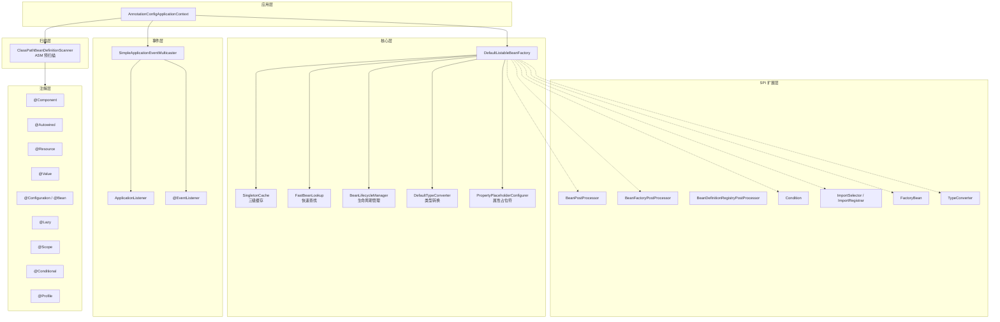

## 核心组件分析

### 1. DefaultListableBeanFactory — 核心 Bean 工厂

**职责**: 框架的心脏，负责 Bean 的注册、实例化、依赖注入、初始化和销毁。

**关键特性**:

| 特性 | 实现方式 |
|------|----------|
| 循环依赖解决 | 三级缓存（SingletonCache） |
| 依赖注入 | @Autowired / @Resource / @Value |
| 构造器注入 | @Autowired 构造器，支持 @Lazy 参数 |
| 字段注入 | MethodHandles 加速注入 |
| 方法注入 | Setter 方法注入 |
| 泛型注入 | List\<T\> / Map 类型支持 |
| 懒加载代理 | JDK 动态代理 |
| FactoryBean | & 前缀获取工厂本身 |
| 类型索引 | 注册时增量构建，查询 O(1) |
| 快速查找 | 前 32 个热门 Bean 数组查找 |
| 拓扑排序 | @DependsOn 优先实例化 |
| 工厂冻结 | preInstantiateSingletons 后锁定 |

**Bean 创建流程**:

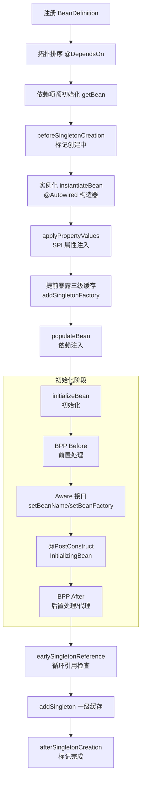

**性能优化亮点**:

| 优化项 | 策略 |
|--------|------|
| 反射缓存 | @Autowired 构造器、默认构造器、注解元数据、setter 方法全部 ConcurrentHashMap 缓存 |
| MethodHandles | 字段注入优先使用 MethodHandle.unreflectSetter，比反射快 |
| 类型索引 | registerBeanDefinition 时增量构建 typeIndex，避免全量遍历 |
| 快速查找表 | singletonsCreated 后构建前 32 个 Bean 的 hash+数组查找表 |
| 冻结 BPP 数组 | preInstantiateSingletons 后将 CopyOnWriteArrayList 转为数组 |
| Aware 位图 | AnnotationMetadata.awareFlags 用 byte 位图替代 instanceof 链 |
| BitSet 注入跟踪 | 防止父类/子类同名字段重复注入 |
| ASM 预扫描 | 扫描时不触发 Class.forName，直接读取字节码判断 @Component |

### 2. SingletonCache — 三级缓存管理

**职责**: 管理单例 Bean 的三级缓存，解决循环依赖。

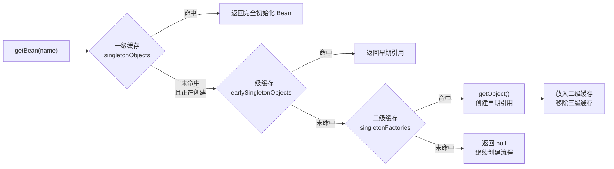

**三级缓存结构**:

| 缓存级别 | 数据结构 | 用途 |
|----------|----------|------|
| 一级缓存 | singletonObjects | 完全初始化的单例 Bean |
| 二级缓存 | earlySingletonObjects | 早期暴露的半成品 Bean（未完成依赖注入和初始化） |
| 三级缓存 | singletonFactories | 单例工厂（ObjectFactory），用于创建早期引用 |

**循环依赖检测**: 使用 ThreadLocal\<Deque\<String\>\> 记录创建调用栈，检测到重复 Bean 时构建完整的循环依赖链路信息。

### 3. BeanLifecycleManager — 生命周期管理

**职责**: 管理 Bean 的初始化和销毁回调。

**初始化顺序**:

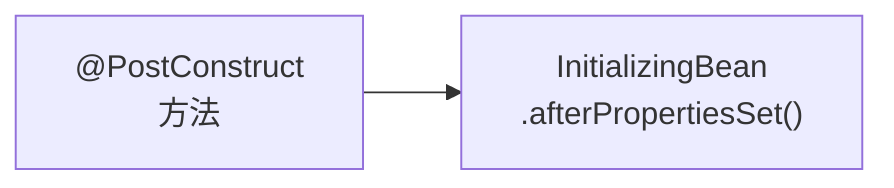

**销毁顺序**:

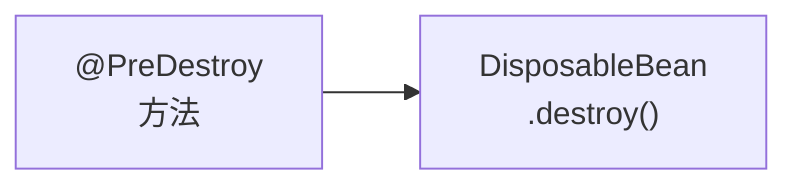

**性能优化**: @PostConstruct / @PreDestroy 方法按 Class 缓存，避免重复反射扫描。从父类到子类递归收集（先父后子）。

### 4. ClassPathBeanDefinitionScanner — 类路径扫描器

**职责**: 扫描指定包路径下的 @Component 类并注册为 BeanDefinition。

**核心特性**:

| 特性 | 说明 |
|------|------|
| ASM 预扫描 | 使用 objectweb.asm 直接读取 class 字节码，无需 Class.forName 即可判断是否有 @Component |
| 缓存组件列表 | 启动时读取 META-INF/lightssm.components 缓存，命中后跳过 ASM 扫描 |
| 并行扫描 | 支持 parallelScan 模式，多包并行扫描 |
| JAR 包支持 | 支持 file:// 和 jar:// 协议 |
| Profile 过滤 | 扫描时根据 Environment 过滤 @Profile 不匹配的类 |

**扫描流程**:

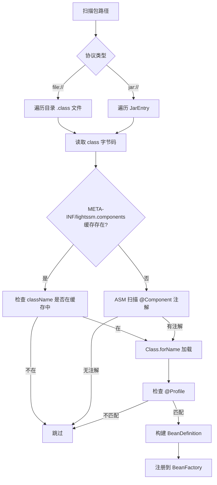

### 5. FastBeanLookup — 快速 Bean 查找

**职责**: 在所有单例创建完成后，提供 O(1) 数组级别的 Bean 查找。

**实现原理**: 将前 32 个 Bean 的 name.hashCode、name、bean 实例存储为平行数组，通过 hash 比对 + equals 实现快速查找，避免 HashMap 的开销。

### 6. DefaultTypeConverter — 类型转换器

**职责**: 为 @Value 注入提供 String 到目标类型的转换。

**支持类型**:

| 类型 | 转换方式 |
|------|----------|
| 基本类型及包装类 | Integer, Long, Boolean, Double, Float, Short, Byte, Character |
| 枚举类型 | Enum.valueOf |
| 自定义类型 | 通过 registerConverter 注册 |

**设计模式**: 策略模式 + Copy-on-Write 不可变表。内置转换器表为不可变 Map，自定义转换器存储在 ConcurrentHashMap 中。

### 7. PropertyPlaceholderConfigurer — 属性占位符解析

**职责**: 解析 ${key} 和 ${key:defaultValue} 占位符。

**解析优先级**:
1. 加载的 properties 文件
2. System.getProperty(key)
3. System.getenv(key)
4. 默认值（如果提供）

**实现**: 作为 BeanFactoryPostProcessor 执行，在 Bean 实例化前加载属性并设置到 BeanFactory。

### 8. SimpleApplicationEventMulticaster — 事件发布器

**职责**: 实现 ApplicationEventPublisher 接口，支持同步/异步事件发布。

**特性**:
- 支持 ApplicationListener\<T\> 接口注册
- 支持 @EventListener 方法扫描注册
- 通过泛型类型推断自动匹配事件类型
- 可配置 Executor 实现异步事件处理

## 注解系统

### 核心注解

```mermaid
classDiagram
    accTitle: IoC 注解体系
    accDescr: 核心注解及其用途的类图。

    class Component {
        +String value()
    }
    class Autowired {
        +boolean required()
    }
    class Resource {
        +String name()
        +Class type()
    }
    class Value {
        +String value()
    }
    class Qualifier {
        +String value()
    }
    class Lazy {
        +boolean value()
    }
    class Scope {
        +String value()
    }
    class Primary {
    }
    class DependsOn {
        +String[] value()
    }
    class Conditional {
        +Class~? extends Condition~[] value()
    }
    class Profile {
        +String[] value()
    }
    class Import {
        +Class~?~[] value()
    }
    class Bean {
        +String[] name()
        +String[] value()
    }
    class Configuration {
        +String value()
    }
    class EventListener {
        +Class~? extends ApplicationEvent~ value()
    }

    Component --> Autowired : "注入"
    Component --> Resource : "注入"
    Component --> Value : "占位符注入"
    Component --> Qualifier : "消除歧义"
    Component --> Lazy : "懒加载"
    Component --> Scope : "作用域"
    Component --> Primary : "首选 Bean"
    Component --> DependsOn : "依赖顺序"
    Component --> Conditional : "条件注册"
    Component --> Profile : "环境过滤"
    Configuration --> Bean : "声明式 Bean"
    Component --> Import : "导入配置"
    Component --> EventListener : "事件监听"
```

### 注解对照表

| 注解 | 用途 | 支持的注入目标 |
|------|------|----------------|
| @Component | 组件声明 | 类 |
| @Autowired | 自动装配（按类型） | 字段、方法、构造器参数 |
| @Resource | 资源注入（按名称优先） | 字段、方法 |
| @Value | 占位符注入 | 字段 |
| @Qualifier | 消除类型歧义 | 字段、构造器参数、方法参数、类 |
| @Lazy | 懒加载 | 类、字段、构造器参数 |
| @Scope | 作用域（singleton/prototype） | 类 |
| @Primary | 首选 Bean | 类 |
| @DependsOn | 依赖顺序 | 类 |
| @Conditional | 条件注册 | 类、@Bean 方法 |
| @Profile | 环境过滤 | 类 |
| @Import | 导入配置类 | 类 |
| @Configuration | 配置类 | 类 |
| @Bean | 声明式 Bean | 方法 |
| @EventListener | 事件监听 | 方法 |

## SPI 扩展机制

### 扩展点一览

```mermaid
classDiagram
    accTitle: SPI 扩展接口体系
    accDescr: 框架提供的 SPI 扩展接口及其继承关系。

    class Aware {
        <<interface>>
    }
    class BeanNameAware {
        <<interface>>
        +setBeanName(name)
    }
    class BeanFactoryAware {
        <<interface>>
        +setBeanFactory(factory)
    }
    class ApplicationContextAware {
        <<interface>>
        +setApplicationContext(ctx)
    }
    class BeanPostProcessor {
        <<interface>>
        +postProcessBeforeInitialization()
        +postProcessAfterInitialization()
        +getEarlyBeanReference()
    }
    class BeanFactoryPostProcessor {
        <<interface>>
        +postProcessBeanFactory(factory)
    }
    class BeanDefinitionRegistryPostProcessor {
        <<interface>>
        +postProcessBeanDefinitionRegistry(registry)
    }
    class Condition {
        <<interface>>
        +matches(context)
    }
    class ImportSelector {
        <<interface>>
        +selectImports()
    }
    class ImportBeanDefinitionRegistrar {
        <<interface>>
        +registerBeanDefinitions(registry)
    }
    class FactoryBean~T~ {
        <<interface>>
        +getObject()
        +getObjectType()
        +isSingleton()
    }
    class TypeConverter {
        <<interface>>
        +supports(targetType)
        +convert(source, targetType)
        +getOrder()
    }
    class BeanInjector~T~ {
        <<interface>>
        +create()
        +inject(instance, factory)
        +postConstruct(instance)
    }
    class BeanDefinitionRegistry {
        <<interface>>
        +registerBeanDefinition()
        +removeBeanDefinition()
        +getBeanDefinition()
        +registerAlias()
    }

    Aware <|-- BeanNameAware
    Aware <|-- BeanFactoryAware
    Aware <|-- ApplicationContextAware
    BeanFactoryPostProcessor <|-- BeanDefinitionRegistryPostProcessor
    BeanDefinitionRegistry --> BeanDefinitionRegistryPostProcessor : "参数"
    BeanFactoryPostProcessor --> DefaultListableBeanFactory : "参数"
```

### SPI 详细列表

| 扩展点 | 接口 | 执行时机 | 用途 |
|--------|------|----------|------|
| **BeanNameAware** | Aware | 初始化阶段 | 获取 Bean 名称 |
| **BeanFactoryAware** | Aware | 初始化阶段 | 获取 BeanFactory 引用 |
| **ApplicationContextAware** | Aware | 初始化阶段 | 获取 ApplicationContext 引用 |
| **BeanPostProcessor** | SPI | 每个 Bean 初始化前后 | 修改/代理 Bean 实例 |
| **BeanFactoryPostProcessor** | SPI | Bean 实例化前 | 修改 BeanFactory 配置 |
| **BeanDefinitionRegistryPostProcessor** | SPI | BeanFactoryPostProcessor 前 | 动态注册 BeanDefinition |
| **Condition** | SPI | 注册 Bean 前 | 条件化 Bean 注册 |
| **ImportSelector** | SPI | @Import 处理时 | 动态选择导入类 |
| **ImportBeanDefinitionRegistrar** | SPI | @Import 处理时 | 编程式注册 Bean |
| **FactoryBean** | SPI | getBean 时 | 自定义 Bean 创建逻辑 |
| **TypeConverter** | SPI | @Value 注入时 | 自定义类型转换 |
| **BeanInjector** | SPI | 编译时生成 | APT 生成的 DI 代码 |

### 自动配置 SPI

框架支持通过 `META-INF/lightssm.spi` 文件实现自动配置：

```
# META-INF/lightssm.spi
com.example.autoconfigure.DatabaseAutoConfiguration
com.example.autoconfigure.RedisAutoConfiguration
```

启动时自动扫描并注册这些配置类，同时支持 @Conditional 条件过滤。

## ApplicationContext 启动流程

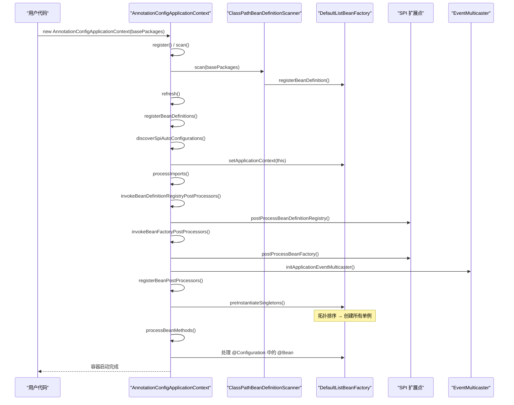

## BeanDefinition 设计

**标志位压缩**: 使用 byte 位图存储布尔标志，节省内存。

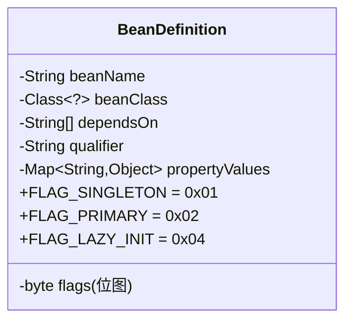

| 位 | 标志 | 含义 |
|----|------|------|
| 0x01 | FLAG_SINGLETON | 是否为单例（默认） |
| 0x02 | FLAG_PRIMARY | 是否为首选 Bean |
| 0x04 | FLAG_LAZY_INIT | 是否懒加载 |

## 依赖注入策略

### 注入优先级

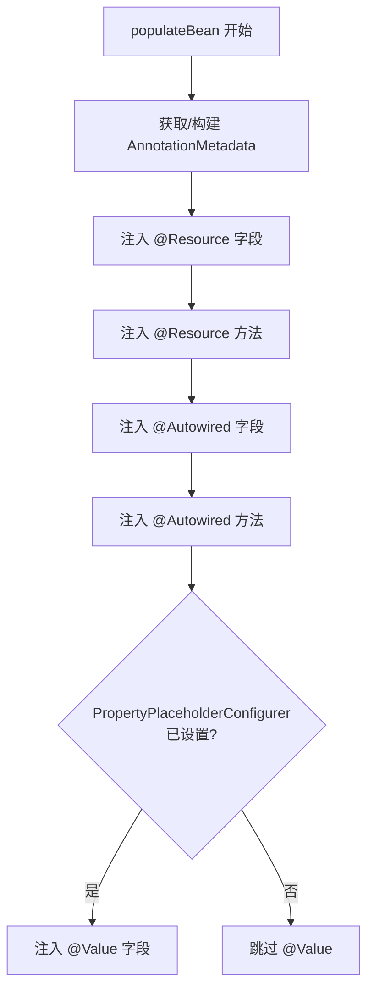

**@Resource vs @Autowired**:
- @Resource 优先注入（支持按名称查找）
- @Autowired 后注入（按类型查找）
- BitSet 防止重复注入（父类/子类同名字段）

### 构造器解析策略

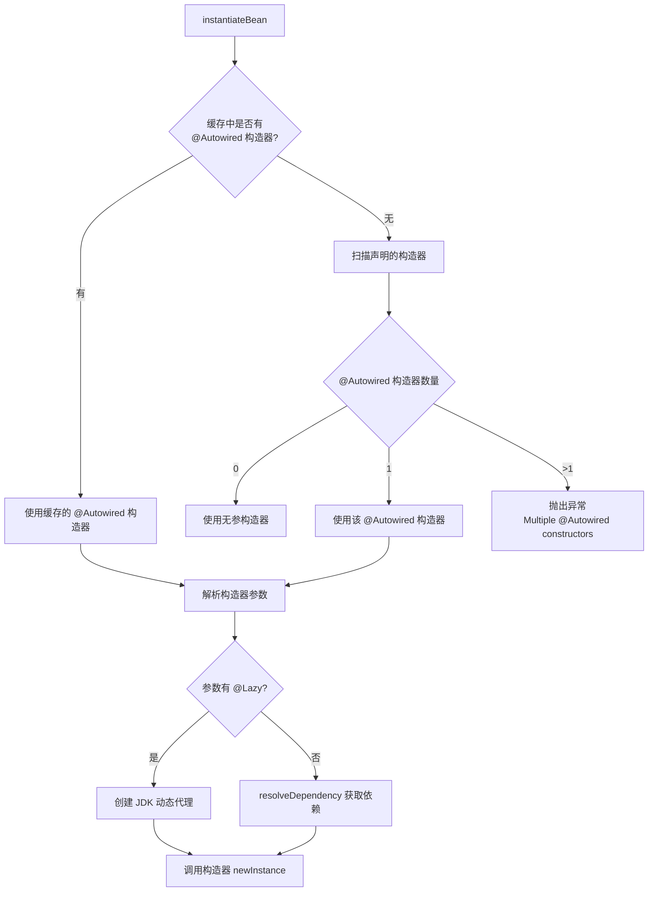

## 性能优化总览

| 优化项 | 实现位置 | 效果 |
|--------|----------|------|
| 反射缓存 | cachedAutowiredConstructors, cachedAnnotationMetadata | 避免重复反射扫描 |
| MethodHandles 注入 | createFieldInjector | 字段注入比反射快 |
| 类型索引 | typeIndex (ConcurrentHashMap) | getBeanNamesForType 从 O(n) 到 O(1) |
| 快速查找表 | FastBeanLookup (前32个Bean) | hot path 避免 HashMap.get() |
| 冻结 BPP 数组 | frozenBpps | 遍历 BeanPostProcessor 无同步开销 |
| Aware 位图 | AnnotationMetadata.awareFlags | 替代 instanceof 链 |
| BitSet 注入跟踪 | injectedFieldBits / injectedMethodBits | 防止重复注入，替代 HashSet |
| ASM 预扫描 | scanAnnotationWithAsm | 避免 Class.forName 触发类加载 |
| 组件缓存 | META-INF/lightssm.components | 跳过 ASM 扫描 |
| Setter 缓存 | cachedSetterMethods | applyPropertyValues 避免重复反射 |

## 框架接口层次

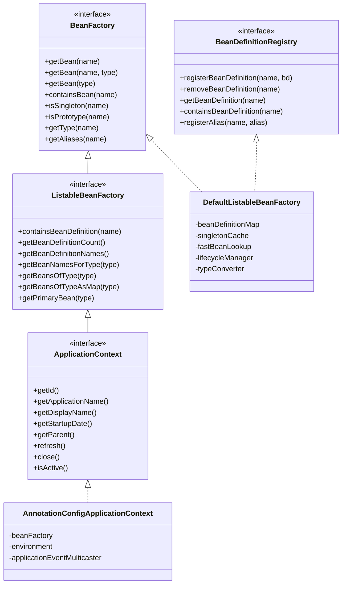

## 关键设计模式总结

| 模式 | 应用位置 | 说明 |
|------|----------|------|
| **工厂模式** | BeanFactory / FactoryBean | Bean 的创建和管理 |
| **策略模式** | TypeConverter / Condition | 可替换的算法实现 |
| **观察者模式** | ApplicationEvent / ApplicationListener | 事件发布-订阅 |
| **模板方法模式** | DefaultListableBeanFactory.doCreateBean | 定义 Bean 创建骨架 |
| **组合模式** | SingletonCache | 封装三级缓存复杂性 |
| **单例模式** | 单例 Bean 缓存 | 全局唯一实例 |
| **代理模式** | LazyInvocationHandler | 懒加载动态代理 |
| **建造者模式** | BeanDefinition | Bean 元数据构建 |
| **注册表模式** | BeanDefinitionRegistry | Bean 定义注册和查找 |

## 技术栈

| 依赖 | 用途 |
|------|------|
| objectweb.asm (ASM9) | 字节码扫描，避免类加载 |
| jakarta.annotation | @PostConstruct / @PreDestroy |
| SLF4J | 日志门面 |
